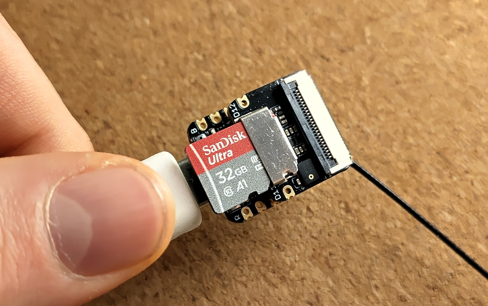
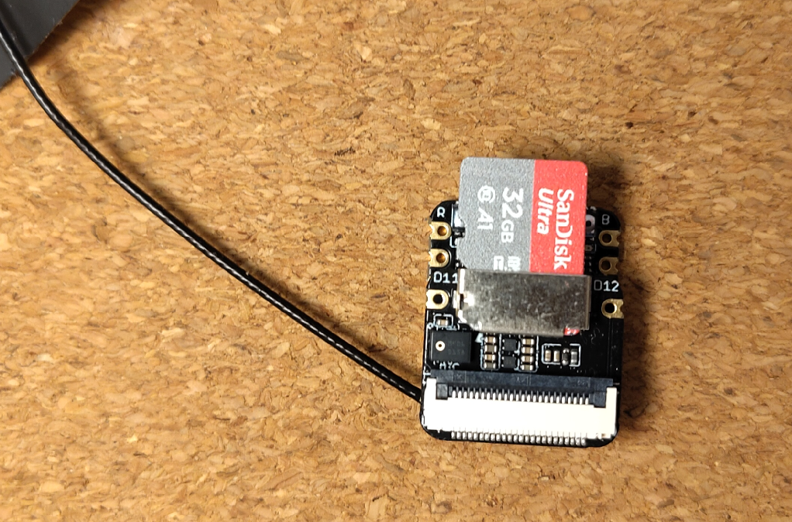
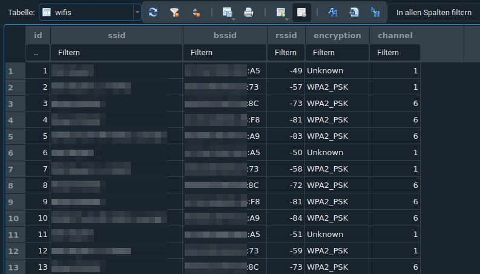

# Wifi Scanner
*Author: [Friedjof Noweck](https://github.com/friedjof)*

This is a simple wifi scanner for the esp32s3. It uses the esp-idf framework and the esp32s3-devkitm-1 board. The scanner will scan for wifi networks and save the results in a sqlite3 database. The database is stored on the separate micro sd card. The scanner will also print the results to the serial console.

A simular project is the [WifiTester](https://github.com/Friedjof/WifiTester) for the **esp32dev** microcontroller.



## Requirements
The Seed Studio ESP32-S3 Board is a compact and efficient development tool designed for IoT and image processing projects, featuring:

- An ESP32-S3 microcontroller with WiFi and Bluetooth capabilities.
- A single connector for a camera module, equipped with a micro SD card slot for extended functionality.
- Ideal for applications like surveillance and facial recognition.
- USB-C connection for power and programming, offering modern connectivity.
- Also operable via battery, enhancing its portability.
- Its compact size and energy efficiency make it well-suited for embedded systems.

For more details, see the [sources](#sources) below.



## Database
The database is stored on the micro sd card. The database is called `wifi.sqlite3` and has a single table called `wifis`. The table has the following columns:
- `id` - The primary key of the table (autoincrement)
- `ssid` - The name of the wifi network
- `bssid` - The mac address of the AP
- `channel` - The wifi channel
- `rssi` - The signal strength
- `encryption` - The encryption type



## Usage
To prepare and use the Micro SD card for your ESP32-S3 Board project, follow these steps:

1. **Format the Micro SD Card**: Use a tool to format the Micro SD card (up to 32GB) to the FAT32 file system.
2. **Copy the File**: Transfer the `wifi.sqlite` file from the `/template` folder to the formatted Micro SD card.
3. **Insert the SD Card**: Place the prepared Micro SD card into the ESP32-S3 Board.

## Installation
You need the platformio to build and flash the project to the microcontroller. You can install platformio with the following command.
```bash
pip install platformio
```
**Or** use the `nix-shell` of this project to install platformio.
```bash
nix-shell
```

## Build and Flash
With the following command, you can build the project and flash it to the microcontroller. You might need to change the port in the `Makefile` to the port of your microcontroller.
```bash
make build
```
You can use the following command to flash the project to the microcontroller.
```bash
make flash
```
Open the serial monitor to see the results of the wifi scan. You can use the following command to open the serial monitor.
```bash
make monitor
```
For more advanced commands, you can use the help command.
```bash
make help
```

## Flashing from the release page
### Flashing
In the release section, you can find the latest binary files for the microcontrollers. You can use the following commands to flash the binary files to the `ESP32S3`.
You need to change the `--port` parameter to match your system configuration and the path to the binary files.

Install the esptool with the following command if you haven't already.
```bash
pip install esptool
```

Flash the bootloader, partitions, and firmware to the microcontroller.
```bash
esptool.py --port /dev/ttyUSB0 --baud 921600 --before default_reset --after hard_reset write_flash -z --flash_mode dio --flash_freq 40m --flash_size detect 0x1000 bootloader.bin 0x8000 partitions.bin 0x10000 firmware.bin
```

## How to contribute
If you want to contribute to this project, feel free to create a fork and submit a pull request. You can also create an issue if you find a bug or have a feature request.

## Sources
- [ESP32-S3 Getting Started](https://wiki.seeedstudio.com/xiao_esp32s3_getting_started/)
- [ESP-IDF Programming Guide](https://docs.espressif.com/projects/esp-idf/en/latest/esp32s3/index.html)
- [ESP32S3 Data Sheet](https://www.espressif.com/sites/default/files/documentation/esp32-s3_datasheet_en.pdf)
